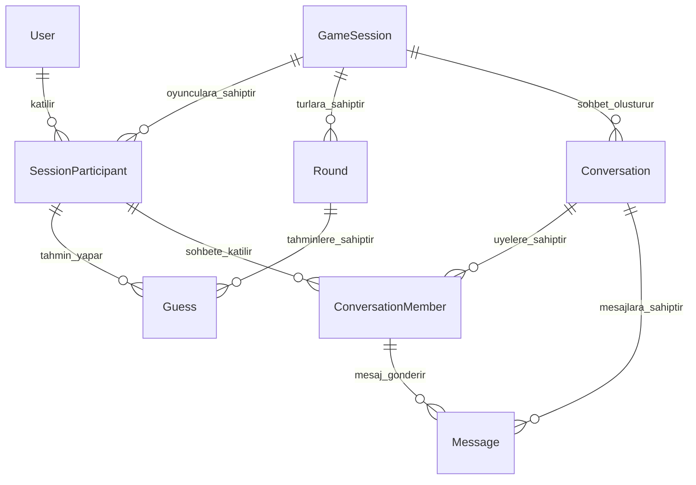

# Kelime Tahmin Oyunu

Bu proje, aynı kelimeyi tahmin eden oyuncuları art arda turlarda eşleştiren ve son aşamaya kalan oyuncuların birbirleriyle mesajlaşmasını sağlayan çevrim içi bir kelime oyunudur.

Oyuncu siteye bir nickname ile girer, açılacak oyun oturumuna katılır ve her turda bir kelime tahmini gönderir. Aynı kelimeyi yazan oyuncular sonraki tura geçerken eşleşmeyen oyuncular elenir. Oyun sonunda aynı grupta kalan finalistler birbirlerinin nickname'lerini görebilir ve kendilerine açılan sohbet odasında mesajlaşabilir.

## Veritabanı yapısı

Projede MySQL ve Prisma ORM kullanılmaktadır. Prisma şeması `prisma/schema.prisma` dosyasındadır.

Veritabanı sekiz temel modelden oluşur:

| Prisma modeli | Veritabanındaki görevi |
| --- | --- |
| `User` | Siteyi kullanan kişiyi ve tarayıcı kimliğini saklar. |
| `GameSession` | Belirli bir zamanda başlayan bağımsız oyunu saklar. |
| `SessionParticipant` | Kullanıcının belirli bir oyuna katılımını ve oyun içindeki durumunu saklar. |
| `Round` | Bir oyun içerisindeki turları ve tur sürelerini saklar. |
| `Guess` | Bir oyuncunun belirli bir turdaki kelime tahminini saklar. |
| `Conversation` | Aynı kelimeyle finale kalan oyuncuların sohbet odasını saklar. |
| `ConversationMember` | Hangi finalistlerin hangi sohbet odasına girebildiğini saklar. |
| `Message` | Sohbet odalarında gönderilen mesajları saklar. |

Her model ayrı bir sorumluluğa sahiptir. Böylece kullanıcı bilgileri, oyun durumu, tahminler ve mesajlar birbirine karışmadan yönetilebilir.

## Enum'lar

Enum'lar, durum alanlarına yalnızca sistemin tanıdığı değerlerin yazılmasını sağlar. Örneğin serbest bir `String` yerine enum kullanılması, `ACTIVE` yerine yanlışlıkla `ACTVE` kaydedilmesini önler.

### `GameStatus`

Oyun oturumunun genel durumunu belirtir.

| Değer | Anlamı |
| --- | --- |
| `WAITING` | Oyun başlamayı ve oyuncuların katılmasını bekliyor. |
| `ACTIVE` | Oyun başladı ve turlar devam ediyor. |
| `FINISHED` | Oyun normal şekilde tamamlandı. |
| `CANCELLED` | Oyun yetersiz oyuncu veya başka bir nedenle iptal edildi. |

Normal durum geçişi:

```text
WAITING → ACTIVE → FINISHED
                 ↘ CANCELLED
```

### `RoundStatus`

Tek bir turun işlem durumunu belirtir.

| Değer | Anlamı |
| --- | --- |
| `WAITING` | Tur oluşturuldu ancak henüz başlamadı. |
| `ACTIVE` | Oyuncular kelime tahmini gönderebilir. |
| `PROCESSING` | Tahmin alımı kapandı ve eşleşmeler hesaplanıyor. |
| `FINISHED` | Tur sonuçlandırıldı. |

Normal durum geçişi:

```text
WAITING → ACTIVE → PROCESSING → FINISHED
```

`PROCESSING` aşamasında yeni tahmin kabul edilmemelidir. Bu aşama, aynı kelimeyi yazan oyuncuların güvenli şekilde hesaplanması için kullanılır.

### `ParticipantStatus`

Bir kullanıcının belirli bir oyundaki durumunu belirtir.

| Değer | Anlamı |
| --- | --- |
| `ACTIVE` | Oyuncu oyuna devam ediyor. |
| `ELIMINATED` | Oyuncunun tahmini eşleşmedi ve oyuncu elendi. |
| `FINALIST` | Oyuncu final grubuna kaldı ve sohbet hakkı kazandı. |
| `LEFT` | Oyuncu oyun tamamlanmadan ayrıldı. |

Bu durum `User` üzerinde değil, `SessionParticipant` üzerinde tutulur. Aynı kullanıcı bir oyunda elenmiş, başka bir oyunda finalist olmuş olabilir.

### `ConversationStatus`

Finalist sohbetinin durumunu belirtir.

| Değer | Anlamı |
| --- | --- |
| `ACTIVE` | Sohbet yeni mesaj kabul ediyor. |
| `CLOSED` | Sohbet kapalı ve yeni mesaj kabul etmiyor. |

## Modeller

### `User`

Siteyi kullanan kişiyi temsil eder.

Önemli alanları:

- `id`: Kullanıcının değişmeyen benzersiz kimliği.
- `nickname`: Kullanıcının güncel görünen adı.
- `clientToken`: Üyelik sistemi olmadan aynı tarayıcıyı yeniden tanımak için kullanılır.
- `createdAt`: Kullanıcının ilk oluşturulma zamanı.
- `lastSeenAt`: Kullanıcı kaydı güncellendiğinde otomatik yenilenir.

Bir kullanıcı zaman içerisinde birçok oyuna katılabilir.

### `GameSession`

Tek bir oyun oturumunu temsil eder. Dakikada bir yeni oturum açılması planlanıyorsa her başlangıç zamanı için yeni bir `GameSession` oluşturulur.

Önemli alanları:

- `startsAt`: Oyunun başlayacağı zaman.
- `joinClosesAt`: Yeni oyuncu kabulünün sona ereceği zaman.
- `status`: Oyunun genel durumu.
- `finishedAt`: Oyun tamamlandığında veya iptal edildiğinde doldurulur.

Oyunun aktif turu `GameSession` üzerinde ayrıca tutulmaz. İlgili oyuna ait `status = ACTIVE` durumundaki `Round` kaydı sorgulanarak bulunur. Böylece aynı tur bilgisi iki farklı yerde saklanmaz ve durum tutarsızlığı riski azalır.

`startsAt` benzersizdir; aynı başlangıç zamanına sahip iki oyun açılamaz.

### `SessionParticipant`

`User` ile `GameSession` arasındaki katılım kaydıdır. Bir kullanıcı birçok oyuna, bir oyun da birçok kullanıcıya sahip olabileceği için bu ilişki ayrı bir ara modelle tutulur.

Önemli alanları:

- `sessionId`: Katılınan oyun.
- `userId`: Katılan kullanıcı.
- `nicknameSnapshot`: Kullanıcının oyuna katıldığı andaki nickname'i.
- `status`: Oyuncunun bu oyunda aktif, elenmiş veya finalist olma durumu.
- `eliminatedRound`: Oyuncunun elendiği tur.
- `finalRound`: Oyuncunun ulaştığı son tur.

`nicknameSnapshot`, kullanıcı daha sonra nickname'ini değiştirse bile geçmiş oyundaki adın değişmemesini sağlar.

`@@unique([sessionId, userId])` kısıtı aynı kullanıcının aynı oyuna iki kez katılmasını engeller.

### `Round`

Bir oyun içindeki tek bir turu temsil eder.

Önemli alanları:

- `sessionId`: Turun ait olduğu oyun.
- `roundNumber`: Turun oyun içindeki sırası.
- `startsAt`: Tahmin alımının başladığı zaman.
- `endsAt`: Tahmin alımının bittiği zaman.
- `status`: Turun mevcut işlem durumu.

`@@unique([sessionId, roundNumber])` kısıtı aynı oyunda aynı tur numarasının iki defa oluşturulmasını engeller.

### `Guess`

Bir oyuncunun belirli bir turda gönderdiği kelimeyi temsil eder.

Önemli alanları:

- `roundId`: Tahminin gönderildiği tur.
- `sessionParticipantId`: Tahmini yapan oyun katılımcısı.
- `originalWord`: Kullanıcının yazdığı kelimenin orijinal biçimi.
- `normalizedWord`: Eşleştirmede kullanılan standartlaştırılmış biçim.
- `submittedAt`: Tahminin gönderildiği zaman.

Örneğin `" ELMA "` ve `"elma"` tahminlerinin eşleşebilmesi için her ikisinin `normalizedWord` değeri `"elma"` olarak saklanabilir. Türkçe `I`, `İ`, `ı` ve `i` karakterlerinin normalizasyonu sunucu tarafında dikkatle yapılmalıdır.

`@@unique([roundId, sessionParticipantId])` kısıtı bir oyuncunun aynı turda yalnızca bir tahmin göndermesini sağlar.

`@@index([roundId, normalizedWord])` indeksi aynı turda aynı kelimeyi yazan oyuncuların hızlı bulunmasını sağlar.

### `Conversation`

Aynı kelimeyle son aşamaya kalan oyuncular için açılan sohbet odasını temsil eder.

Önemli alanları:

- `sessionId`: Sohbetin oluştuğu oyun.
- `finalRound`: Grubun finale kaldığı tur.
- `normalizedWord`: Oyuncuları eşleştiren son kelime.
- `status`: Sohbetin açık veya kapalı olması.
- `closesAt`: Süreli sohbetlerde kapanış zamanı.

Aynı oyunda farklı kelimelerle eşleşen gruplar oluşabilir. Örneğin `elma` yazan iki kişi ile `araba` yazan iki kişi ayrı sohbet odalarına alınabilir.

`@@unique([sessionId, finalRound, normalizedWord])` kısıtı aynı finalist grubu için iki sohbet açılmasını engeller.

### `ConversationMember`

Bir finalist oyuncunun belirli bir sohbet odasına üyeliğini temsil eder. `SessionParticipant` ile `Conversation` arasındaki çoktan çoğa ilişkiyi yönetir.

Birleşik kimlik:

```prisma
@@id([conversationId, sessionParticipantId])
```

Bu kimlik aynı oyuncunun aynı sohbete iki kez eklenmesini engeller. Ayrıca bir mesaj gönderilirken gönderen oyuncunun gerçekten o sohbetin üyesi olduğu veritabanı ilişkisi üzerinden kontrol edilebilir.

### `Message`

Finalist sohbetinde gönderilen tek bir mesajı temsil eder.

Önemli alanları:

- `conversationId`: Mesajın gönderildiği sohbet.
- `senderParticipantId`: Mesajı gönderen katılımcı.
- `body`: Mesajın metin içeriği.
- `createdAt`: Gönderilme zamanı.
- `deletedAt`: Mesaj silinirse silinme zamanı.

`deletedAt` kullanılması mesajın doğrudan veritabanından kaldırılması yerine yumuşak silme yapılmasına imkân verir.

`Message.sender` ilişkisi hem `conversationId` hem de `senderParticipantId` üzerinden `ConversationMember` modeline bağlanır. Böylece mesajı gönderen kişinin ilgili sohbetin üyesi olması gerekir.

## Model ilişkileri



İlişkilerin özeti:

- Bir `User`, birçok `SessionParticipant` kaydına sahip olabilir.
- Bir `GameSession`, birçok katılımcıya, tura ve finalist sohbetine sahip olabilir.
- Bir `Round`, birçok `Guess` kaydına sahip olabilir.
- Bir `SessionParticipant`, her tur için en fazla bir tahmin gönderebilir.
- Bir `Conversation`, birçok `ConversationMember` ve `Message` kaydına sahip olabilir.
- Bir `ConversationMember`, yalnızca üyesi olduğu sohbet adına mesaj gönderebilir.

## Temel oyun akışı

1. Kullanıcı nickname girer ve bir `User` kaydı bulunur veya oluşturulur.
2. Dakikalık oyun için bir `GameSession` oluşturulur.
3. Kullanıcı oyuna katıldığında `SessionParticipant` kaydı oluşturulur.
4. Oyun başlayınca ilk `Round` aktif hale getirilir.
5. Her oyuncunun tahmini `Guess` olarak kaydedilir.
6. Tur süresi bitince tur `PROCESSING` durumuna alınır.
7. Aynı `normalizedWord` değerine sahip en az iki oyuncu sonraki tura geçirilir.
8. Eşleşmeyen oyuncular `ELIMINATED` durumuna alınır.
9. Son aşamaya kalan oyuncular `FINALIST` durumuna alınır.
10. Her finalist grubu için bir `Conversation` ve üyeleri için `ConversationMember` kayıtları oluşturulur.
11. Finalistler `Message` kayıtları üzerinden mesajlaşır.

## Önemli uygulama kuralları

- Oyun ve tur süreleri tarayıcı saatine değil sunucu saatine göre kontrol edilmelidir.
- Tur `ACTIVE` değilse yeni tahmin kabul edilmemelidir.
- Tahmin normalizasyonu API tarafında tek bir fonksiyonla yapılmalıdır.
- Tur sonuçlandırma işlemi transaction içinde gerçekleştirilmelidir.
- Bir oyuncunun yalnızca katıldığı oyun ve üye olduğu sohbet üzerinde işlem yapabildiği doğrulanmalıdır.
- Oyun sonsuza kadar sürmemelidir. Maksimum tur sayısı veya zaman sınırı belirlenmelidir.
- WebSocket anlık ekran güncellemeleri için kullanılabilir; asıl oyun durumu veritabanında tutulmalıdır.

## Prisma dosyaları

- Prisma şeması: `prisma/schema.prisma`
- Veritabanı sağlayıcısı: MySQL
- Prisma istemcisi: `@prisma/client`

Prisma 7 kullanıldığı için veritabanı bağlantı ayarlarının proje yapısına uygun bir `prisma.config.ts` dosyasında tanımlanması gerekir. Bağlantı bilgileri kaynak koda yazılmamalı, `.env` üzerinden okunmalıdır.
