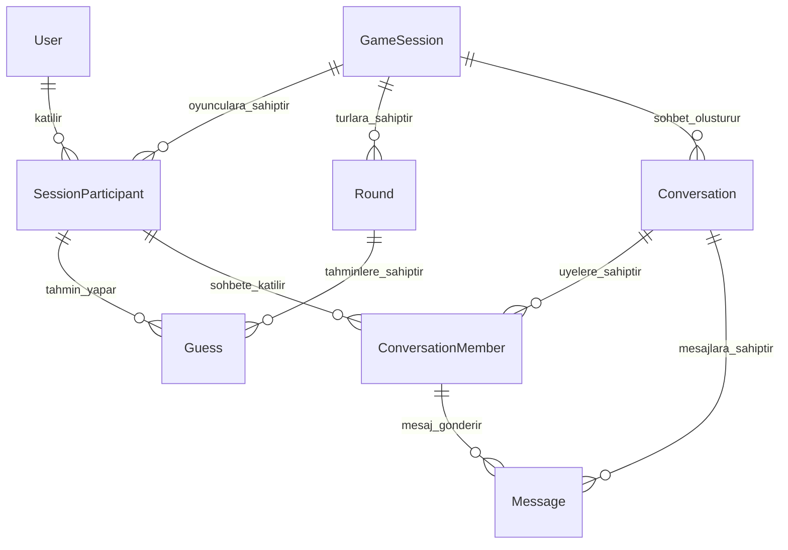

# Kelime Tahmin Oyunu

Bu proje, aynı kelimeyi tahmin eden oyuncuları art arda turlarda eşleştiren ve son aşamaya kalan oyuncuların birbirleriyle mesajlaşmasını sağlayan çevrim içi bir kelime oyunudur.

Oyuncu siteye bir nickname ile girer ve doğrudan tahmin ekranına düşer. Kelimesini yazar, tur süresinin dolmasını bekler; aynı kelimeyi yazanlar sonraki tura birlikte geçerken eşleşmeyenler elenir. Üçüncü turun sonunda hayatta kalan gruplar finalist olur; aynı gruptaki oyuncular birbirlerinin nickname'lerini görebilir ve kendilerine açılan sohbet odasında mesajlaşabilir.

### Ayrı bir lobi aşaması yoktur

Oyuncu bekleyip sonra oynamaz; önce oynar, sonra bekler. **İlk tur aynı zamanda katılım penceresidir:** ilk oyuncu geldiğinde oturum ve birinci tur birlikte açılır, o turun süresi boyunca gelen herkes aynı oyuna düşer ve kelimesini istediği an gönderir. Süre dolduğunda tur çözülür.

Bunun sonucu olarak arayüzde "lobiye katıl" gibi bir adım veya buton bulunmaz; oyuncu hiçbir ekranda "lobi" kavramıyla karşılaşmaz.

Oyun başladıktan sonra — yani birinci tur çözüldükten sonra — gelen oyuncular devam eden oyuna alınmaz. Hayatta kalan oyuncular bir kelime etrafında gruplanmış durumdadır ve sonradan katılan birinin bu gruplamada yeri yoktur. Bu oyuncular için yeni bir oturum açılır.

### Katılımın erken kapanması

Katılım, birinci turun bitiminden `JOIN_CUTOFF_SECONDS` saniye önce kapanır. Aksi hâlde turun bitmesine iki saniye kala giren bir oyuncunun kelimesini yazmaya vakti olmaz.

Böylece her oyuncuya kelimesini düşünmek için en az bu kadar süre garanti edilir. Eşik geçildikten sonra gelen oyuncular bu oyuna değil, yeni açılan oturuma yönlendirilir — bu da oyunların üst üste binerek akmasını sağlar. Aynı anda birden fazla oyun `ACTIVE` durumda olabilir; katılıma açık olan ise her zaman tektir.

## Oyun parametreleri

Aşağıdaki değerler oyunun temposunu belirler ve tek bir yapılandırma dosyasında tutulmalıdır.

| Parametre | Değer | Anlamı |
| --- | --- | --- |
| `MIN_PLAYERS` | 2 | Bir turun eşleşme üretebilmesi için gereken en az tahmin sayısı. |
| `ROUND_SECONDS` | 60 | Bir turda tahmin göndermek için tanınan süre. |
| `JOIN_CUTOFF_SECONDS` | 15 | İlk turun bitimine bu kadar kala katılım kapanır. |
| `TOTAL_ROUNDS` | 3 | Oyunun kaç tur sürdüğü. Son turda hayatta kalanlar finalist olur. |

Bir oyunun toplam süresi bu değerlerle öngörülebilir: yaklaşık 3 dakika. Oyuncunun bekleyeceği süre ne zaman katıldığına bağlıdır; ilk turda en fazla 60, en az `JOIN_CUTOFF_SECONDS` saniye bekler.

Katılımcı sayısında üst sınır yoktur; katılım penceresi kapanana kadar gelen herkes oyuna alınır. Buna karşılık `TOTAL_ROUNDS` sabit olduğu için oyunun daraltma gücü sabittir, katılımcı sayısı ise değildir. Kalabalık oyunlarda ilk turda oyuncuların büyük kısmı `elma`, `araba` gibi yaygın kelimelerde buluşacağı için eleme az olur ve son turda tek bir kelime etrafında onlarca kişilik gruplar oluşabilir. Bu, oyunun vaat ettiği "seninle aynı kelimeyi düşünen kişiyi bul" hissini zayıflatır.

Bunu katılımı sınırlamadan çözmenin yolu, sohbet tarafında sınır koymaktır: bir finalist grubu belirli bir büyüklüğü aşarsa aynı kelime için birden fazla `Conversation` açılıp oyuncular bunlara dağıtılabilir. Mevcut şema buna izin vermez — `Conversation` üzerindeki `@@unique([sessionId, finalRound, normalizedWord])` kısıtı aynı kelime için ikinci bir sohbet açılmasını engeller. Bu yola gidilirse kısıta bir grup sırası alanı eklenmesi gerekir.

## Veritabanı yapısı

Projede MySQL ve Prisma ORM kullanılmaktadır. Prisma şeması `prisma/schema.prisma` dosyasındadır.

Veritabanı sekiz temel modelden oluşur:

| Prisma modeli | Veritabanındaki görevi |
| --- | --- |
| `User` | Siteyi kullanan kişiyi ve tarayıcı kimliğini saklar. |
| `GameSession` | Bağımsız bir oyun oturumunu ve katılım penceresini saklar. |
| `SessionParticipant` | Kullanıcının belirli bir oyuna katılımını ve oyun içindeki durumunu saklar. |
| `Round` | Bir oyun içerisindeki turları ve tur sürelerini saklar. |
| `Guess` | Bir oyuncunun belirli bir turdaki kelime tahminini saklar. |
| `Conversation` | Aynı kelimeyle finale kalan oyuncuların sohbet odasını saklar. |
| `ConversationMember` | Hangi finalistlerin hangi sohbet odasına girebildiğini saklar. |
| `Message` | Sohbet odalarında gönderilen mesajları saklar. |

Her model ayrı bir sorumluluğa sahiptir. Böylece kullanıcı bilgileri, oyun durumu, tahminler ve mesajlar birbirine karışmadan yönetilebilir.

## Enum'lar

Enum'lar, durum alanlarına yalnızca sistemin tanıdığı değerlerin yazılmasını sağlar. Örneğin serbest bir `String` yerine enum kullanılması, `ACTIVE` yerine yanlışlıkla `ACTVE` kaydedilmesini önler.

### `GameStatus`

Oyun oturumunun genel durumunu belirtir.

| Değer | Anlamı |
| --- | --- |
| `WAITING` | Katılım açık; birinci tur devam ediyor ve yeni oyuncu kabul ediliyor. Aynı anda yalnızca bir oyun bu durumda olabilir. |
| `ACTIVE` | Katılım kapandı; oyun kendi oyuncularıyla devam ediyor. |
| `FINISHED` | Oyun tamamlandı. Finalist üretmiş olabilir de olmayabilir de. |
| `CANCELLED` | Katılım kapandığında oyuncu sayısı `MIN_PLAYERS` altında kaldığı için oyun iptal edildi. |

`WAITING` durumu, sezgisel olabileceğinin aksine "henüz başlamadı" anlamına gelmez. Birinci tur bu durumda işler; ayrımı yapan şey oyunun başlayıp başlamadığı değil, katılıma açık olup olmadığıdır. `lobbyKey` alanı da tam olarak bu durumla birlikte dolu kalır.

Normal durum geçişi:

```text
WAITING → ACTIVE → FINISHED
        ↘ CANCELLED
```

`CANCELLED` durumuna yalnızca `WAITING` üzerinden geçilir: katılım kapandığında oyuncu sayısı yeterli değildir. Bu kontrol turun bitişinde değil katılımın kapanışında yapılır — tek başına kalan oyuncuyu boş yere turun sonuna kadar bekletmenin anlamı yoktur. Bir kez `ACTIVE` olan oyun her hâlükârda `FINISHED` ile biter, finalist üretmese bile.

### `RoundStatus`

Tek bir turun işlem durumunu belirtir.

| Değer | Anlamı |
| --- | --- |
| `WAITING` | Tur oluşturuldu ancak henüz başlamadı. |
| `ACTIVE` | Oyuncular kelime tahmini gönderebilir. |
| `PROCESSING` | Tahmin alımı kapandı ve eşleşmeler hesaplanıyor. |
| `FINISHED` | Tur sonuçlandırıldı. |

Normal durum geçişi:

```text
WAITING → ACTIVE → PROCESSING → FINISHED
```

`PROCESSING` aşamasında yeni tahmin kabul edilmemelidir. Bu aşama, aynı kelimeyi yazan oyuncuların güvenli şekilde hesaplanması için kullanılır.

### `ParticipantStatus`

Bir kullanıcının belirli bir oyundaki durumunu belirtir.

| Değer | Anlamı |
| --- | --- |
| `ACTIVE` | Oyuncu oyuna devam ediyor. |
| `ELIMINATED` | Oyuncunun tahmini eşleşmedi ve oyuncu elendi. |
| `FINALIST` | Oyuncu final grubuna kaldı ve sohbet hakkı kazandı. |
| `LEFT` | Oyuncu oyun tamamlanmadan ayrıldı. |

Bu durum `User` üzerinde değil, `SessionParticipant` üzerinde tutulur. Aynı kullanıcı bir oyunda elenmiş, başka bir oyunda finalist olmuş olabilir.

### `ConversationStatus`

Finalist sohbetinin durumunu belirtir.

| Değer | Anlamı |
| --- | --- |
| `ACTIVE` | Sohbet yeni mesaj kabul ediyor. |
| `CLOSED` | Sohbet kapalı ve yeni mesaj kabul etmiyor. |

## Modeller

### `User`

Siteyi kullanan kişiyi temsil eder.

Önemli alanları:

- `id`: Kullanıcının değişmeyen benzersiz kimliği.
- `nickname`: Kullanıcının güncel görünen adı.
- `clientToken`: Üyelik sistemi olmadan aynı tarayıcıyı yeniden tanımak için kullanılır.
- `createdAt`: Kullanıcının ilk oluşturulma zamanı.
- `lastSeenAt`: Kullanıcı kaydı güncellendiğinde otomatik yenilenir.

Bir kullanıcı zaman içerisinde birçok oyuna katılabilir.

### `GameSession`

Tek bir oyun oturumunu temsil eder. Oturum, katılıma açık bir oyun yokken ilk oyuncu siteye girdiğinde birinci turuyla birlikte oluşturulur.

Önemli alanları:

- `startsAt`: Oyunun başladığı zaman; oturumun oluşturulma anıyla aynıdır.
- `joinClosesAt`: Yeni oyuncu kabulünün sona erdiği zaman. Birinci turun bitişinden `JOIN_CUTOFF_SECONDS` saniye öncesine denk gelir.
- `status`: Oyunun genel durumu.
- `finishedAt`: Oyun tamamlandığında veya iptal edildiğinde doldurulur.

Oyunun aktif turu `GameSession` üzerinde ayrıca tutulmaz. İlgili oyuna ait `status = ACTIVE` durumundaki `Round` kaydı sorgulanarak bulunur. Böylece aynı tur bilgisi iki farklı yerde saklanmaz ve durum tutarsızlığı riski azalır.

### Aynı anda tek açık oturum kuralı

Oyuncu havuzunun bölünmemesi için aynı anda yalnızca bir oturum `WAITING` durumunda olabilir. Aksi hâlde iki oyuncu aynı saniyede geldiğinde iki ayrı oturum açılır, her biri tek kişilik kalır ve ikisi de iptal olur.

Bu kural uygulama kodundaki bir kontrolle güvence altına alınamaz; iki eşzamanlı istek de "açık oturum yok" sonucunu okuyup ikisi birden oturum oluşturabilir. Kısıtın veritabanı tarafından uygulanması gerekir.

Bunun için oturumda yalnızca bu işe ayrılmış bir `lobbyKey` alanı bulunur:

- Oturum `WAITING` durumundayken `lobbyKey` sabit `"OPEN"` değerini taşır.
- Katılım kapandığında (oyun `ACTIVE` veya `CANCELLED` olduğunda) `lobbyKey` `NULL` yapılır.
- Alan `@unique` olarak işaretlenmiştir.

MySQL benzersiz indekslerde birden fazla `NULL` değere izin verdiği için bu tanım, geçmişteki oyun sayısından bağımsız olarak aynı anda en fazla bir satırın `"OPEN"` olmasını garanti eder. İkinci oturumu açmaya çalışan istek benzersizlik hatası alır; bu hata yakalanıp mevcut oturum yeniden okunmalıdır.

Alanın yalnızca `"OPEN"` ve `NULL` değerlerini alması kritiktir. Başka bir değer yazılırsa ikinci bir oturum katılıma açık hâle gelir ve kısıt sessizce işlevsiz kalır. Bu yüzden değer koda `LOBBY_KEY_OPEN` sabiti olarak gömülmüştür ve doğrudan dize yazılmamalıdır.

### `SessionParticipant`

`User` ile `GameSession` arasındaki katılım kaydıdır. Bir kullanıcı birçok oyuna, bir oyun da birçok kullanıcıya sahip olabileceği için bu ilişki ayrı bir ara modelle tutulur.

Önemli alanları:

- `sessionId`: Katılınan oyun.
- `userId`: Katılan kullanıcı.
- `nicknameSnapshot`: Kullanıcının oyuna katıldığı andaki nickname'i.
- `status`: Oyuncunun bu oyunda aktif, elenmiş veya finalist olma durumu.
- `eliminatedRound`: Oyuncunun elendiği tur.
- `finalRound`: Oyuncunun ulaştığı son tur.

`nicknameSnapshot`, kullanıcı daha sonra nickname'ini değiştirse bile geçmiş oyundaki adın değişmemesini sağlar.

`@@unique([sessionId, userId])` kısıtı aynı kullanıcının aynı oyuna iki kez katılmasını engeller.

### `Round`

Bir oyun içindeki tek bir turu temsil eder.

Önemli alanları:

- `sessionId`: Turun ait olduğu oyun.
- `roundNumber`: Turun oyun içindeki sırası.
- `startsAt`: Tahmin alımının başladığı zaman.
- `endsAt`: Tahmin alımının bittiği zaman.
- `status`: Turun mevcut işlem durumu.

`@@unique([sessionId, roundNumber])` kısıtı aynı oyunda aynı tur numarasının iki defa oluşturulmasını engeller.

### `Guess`

Bir oyuncunun belirli bir turda gönderdiği kelimeyi temsil eder.

Önemli alanları:

- `roundId`: Tahminin gönderildiği tur.
- `sessionParticipantId`: Tahmini yapan oyun katılımcısı.
- `originalWord`: Kullanıcının yazdığı kelimenin orijinal biçimi.
- `normalizedWord`: Eşleştirmede kullanılan standartlaştırılmış biçim.
- `submittedAt`: Tahminin gönderildiği zaman.

Örneğin `" ELMA "` ve `"elma"` tahminlerinin eşleşebilmesi için her ikisinin `normalizedWord` değeri `"elma"` olarak saklanabilir. Türkçe `I`, `İ`, `ı` ve `i` karakterlerinin normalizasyonu sunucu tarafında dikkatle yapılmalıdır.

`@@unique([roundId, sessionParticipantId])` kısıtı bir oyuncunun aynı turda yalnızca bir tahmin göndermesini sağlar.

`@@index([roundId, normalizedWord])` indeksi aynı turda aynı kelimeyi yazan oyuncuların hızlı bulunmasını sağlar.

### `Conversation`

Aynı kelimeyle son aşamaya kalan oyuncular için açılan sohbet odasını temsil eder.

Önemli alanları:

- `sessionId`: Sohbetin oluştuğu oyun.
- `finalRound`: Grubun finale kaldığı tur.
- `normalizedWord`: Oyuncuları eşleştiren son kelime.
- `status`: Sohbetin açık veya kapalı olması.
- `closesAt`: Süreli sohbetlerde kapanış zamanı.

Aynı oyunda farklı kelimelerle eşleşen gruplar oluşabilir. Örneğin `elma` yazan iki kişi ile `araba` yazan iki kişi ayrı sohbet odalarına alınabilir.

`@@unique([sessionId, finalRound, normalizedWord])` kısıtı aynı finalist grubu için iki sohbet açılmasını engeller.

### `ConversationMember`

Bir finalist oyuncunun belirli bir sohbet odasına üyeliğini temsil eder. `SessionParticipant` ile `Conversation` arasındaki çoktan çoğa ilişkiyi yönetir.

Birleşik kimlik:

```prisma
@@id([conversationId, sessionParticipantId])
```

Bu kimlik aynı oyuncunun aynı sohbete iki kez eklenmesini engeller. Ayrıca bir mesaj gönderilirken gönderen oyuncunun gerçekten o sohbetin üyesi olduğu veritabanı ilişkisi üzerinden kontrol edilebilir.

### `Message`

Finalist sohbetinde gönderilen tek bir mesajı temsil eder.

Önemli alanları:

- `conversationId`: Mesajın gönderildiği sohbet.
- `senderParticipantId`: Mesajı gönderen katılımcı.
- `body`: Mesajın metin içeriği.
- `createdAt`: Gönderilme zamanı.
- `deletedAt`: Mesaj silinirse silinme zamanı.

`deletedAt` kullanılması mesajın doğrudan veritabanından kaldırılması yerine yumuşak silme yapılmasına imkân verir.

`Message.sender` ilişkisi hem `conversationId` hem de `senderParticipantId` üzerinden `ConversationMember` modeline bağlanır. Böylece mesajı gönderen kişinin ilgili sohbetin üyesi olması gerekir.

## Model ilişkileri



İlişkilerin özeti:

- Bir `User`, birçok `SessionParticipant` kaydına sahip olabilir.
- Bir `GameSession`, birçok katılımcıya, tura ve finalist sohbetine sahip olabilir.
- Bir `Round`, birçok `Guess` kaydına sahip olabilir.
- Bir `SessionParticipant`, her tur için en fazla bir tahmin gönderebilir.
- Bir `Conversation`, birçok `ConversationMember` ve `Message` kaydına sahip olabilir.
- Bir `ConversationMember`, yalnızca üyesi olduğu sohbet adına mesaj gönderebilir.

## Temel oyun akışı

1. Kullanıcı nickname girer ve bir `User` kaydı bulunur veya oluşturulur.
2. Katılıma açık oturum (`lobbyKey = "OPEN"`) aranır. Yoksa yeni bir `GameSession` ve birinci `Round` birlikte oluşturulur: turun bitişi `ROUND_SECONDS` sonrası, `joinClosesAt` ise bundan `JOIN_CUTOFF_SECONDS` öncesidir.
3. Kullanıcı oturuma alındığında `SessionParticipant` kaydı oluşturulur ve doğrudan tahmin ekranı gösterilir.
4. Oyuncu kelimesini gönderir; tahmin `Guess` olarak kaydedilir ve oyuncu bekleme durumuna geçer.
5. `joinClosesAt` geldiğinde katılım kapanır ve `lobbyKey` boşaltılır. Bu andan sonra gelen oyuncular için yeni bir oturum açılır; iki oyun bir süre birlikte akar.
6. Katılım kapanırken oyuncu sayısı `MIN_PLAYERS` altındaysa oturum `CANCELLED` olur, değilse `ACTIVE` olur.
7. Tur süresi bitince tur `PROCESSING` durumuna alınır ve yeni tahmin kabul edilmez.
8. Aynı `normalizedWord` değerine sahip en az iki oyuncu sonraki tura geçirilir; eşleşmeyenler ve hiç tahmin göndermemiş olanlar `ELIMINATED` olur.
9. `TOTAL_ROUNDS` sayısına ulaşılmamışsa ve hayatta kalan varsa yeni bir `Round` açılır, 4. adımdan devam edilir. Bu turlara yeni oyuncu katılamaz.
10. Son turun sonunda hayatta kalan oyuncular `FINALIST` durumuna alınır ve oturum `FINISHED` olur.
11. Her finalist grubu için bir `Conversation` ve üyeleri için `ConversationMember` kayıtları oluşturulur.
12. Finalistler `Message` kayıtları üzerinden mesajlaşır.

### Ekran durumları

Arayüz tek bir ekrandan oluşur ve oyuncunun durumuna göre şekil değiştirir. Ayrı bir lobi veya oda seçimi ekranı yoktur.

| Durum | Ekranda görünen |
| --- | --- |
| Nickname yok | Nickname girişi. Yalnızca ilk ziyarette. |
| Tur açık, tahmin gönderilmemiş | Kelime girişi ve geri sayım. |
| Tahmin gönderilmiş, tur sürüyor | Bekleme; geri sayım ve o an oyunda kaç kişi olduğu. |
| Tur çözüldü, oyuncu devam ediyor | Kaç kişiyle eşleştiği ve sıradaki tur (`Tur 2/3`). |
| Oyuncu elendi | "Kimse seninle aynı kelimeyi yazmadı, tekrar dene" ve yeni oyuna girme bağlantısı. |
| Oturum iptal edildi | "Yeterli oyuncu yoktu, tekrar dene" ve yeni oyuna girme bağlantısı. |
| Oyuncu finalist | Finalist sohbeti ve grup üyelerinin nickname'leri. |

### Oyunun erken bitmesi

Oyun her zaman üç tur sürmez. Bir turun sonunda hiçbir grup oluşmazsa — yani herkesin tahmini farklıysa — geriye hayatta kalan oyuncu kalmaz. Bu durumda oturum finalist üretmeden `FINISHED` olur ve hiçbir `Conversation` açılmaz. Arayüzün bu sonucu ayrı bir ekranla ("kimse eşleşemedi") karşılaması gerekir.

Benzer şekilde katılım kapandığında oyuncu sayısı `MIN_PLAYERS` altındaysa oturum `CANCELLED` olur. Düşük trafikte bu en sık karşılaşılacak sonuçtur: siteye tek başına giren oyuncu kelimesini yazar, katılım penceresi kapanır ve kimse gelmemiştir.

Her iki durumda da oyuncu aynı ekranı görür — kimsenin onunla eşleşmediğini söyleyen bir mesaj ve yeniden denemek için bir bağlantı. Oyuncu otomatik olarak sıradaki oyuna aktarılmaz; yeni oyuna girmek için kendisi harekete geçer.

## Önemli uygulama kuralları

- Oyun ve tur süreleri tarayıcı saatine değil sunucu saatine göre kontrol edilmelidir.
- Tur `ACTIVE` değilse yeni tahmin kabul edilmemelidir.
- Oturum `WAITING` değilse veya `joinClosesAt` geçmişse yeni katılım kabul edilmemelidir.
- `lobbyKey` alanına `LOBBY_KEY_OPEN` sabiti dışında bir değer yazılmamalıdır; aksi hâlde tek açık oturum garantisi bozulur.
- Tahmin normalizasyonu ve doğrulaması tek bir modülde toplanmalıdır: `src/lib/words/normalize.ts`.
- Tur sonuçlandırma işlemi transaction içinde gerçekleştirilmelidir.
- Tur ilerletme, `UPDATE ... WHERE status = 'ACTIVE'` biçiminde koşullu bir güncellemeyle korunmalıdır. Aynı turu aynı anda iki isteğin sonuçlandırması hâlinde ikinci güncelleme sıfır satır etkiler ve işlem güvenle sonlandırılır.
- Aynı anda yalnızca bir oturum `WAITING` durumunda olabilir. Bu kısıt uygulama kodunda değil veritabanı seviyesinde uygulanmalıdır.
- Bir oyuncunun yalnızca katıldığı oyun ve üye olduğu sohbet üzerinde işlem yapabildiği doğrulanmalıdır.
- Oyun `TOTAL_ROUNDS` sayısını aşmamalıdır.
- WebSocket anlık ekran güncellemeleri için kullanılabilir; asıl oyun durumu veritabanında tutulmalıdır.

## Prisma dosyaları

- Prisma şeması: `prisma/schema.prisma`
- Veritabanı sağlayıcısı: MySQL
- Prisma istemcisi: `@prisma/client`

Prisma 7 kullanıldığı için veritabanı bağlantı ayarlarının proje yapısına uygun bir `prisma.config.ts` dosyasında tanımlanması gerekir. Bağlantı bilgileri kaynak koda yazılmamalı, `.env` üzerinden okunmalıdır.
